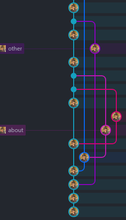

# CLI and GIT

## Command Line Interface
Click [here](README-CLI.md) to know more about CLI 

## GIT
Click [here](README-GIT.md) to know more about GIT 

    

## For more information about CLI and GIT, visit: 
> - [Web3school CLI](https://www.w3schools.com/whatis/whatis_cli.asp).
> - [Web3school GIT](https://www.w3schools.com/git/default.asp?remote=github).
> - [YouTube CLI](https://www.youtube.com/watch?v=3WQu7iWHAhI&list=PLfEr2kn3s-br9ZFmejfLhAgMbGgbpdof8&index=139&pp=iAQB)
> - [YouTube GIT](https://www.youtube.com/watch?v=LdeNFQMI42o&list=PLfEr2kn3s-br9ZFmejfLhAgMbGgbpdof8&index=142)
> - [YouTube (Creating and Deleting branch)](https://www.youtube.com/watch?v=UlckC6wLudI&list=PLfEr2kn3s-br9ZFmejfLhAgMbGgbpdof8&index=142)
> - [YouTube (working with Github)](https://www.youtube.com/watch?v=5aslveqHw-4&list=PLfEr2kn3s-br9ZFmejfLhAgMbGgbpdof8&index=144)
> - [YouTube (Revert and Reset Commits)](https://www.youtube.com/watch?v=qF8CHHnWqXE&list=PLfEr2kn3s-br9ZFmejfLhAgMbGgbpdof8&index=144)